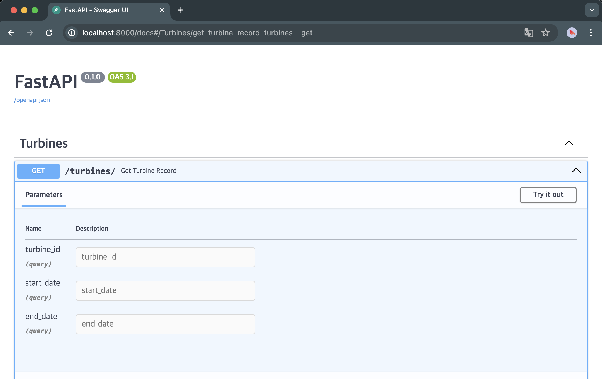

# fastapi-webapp

web application using with FastAPI and React

### start

To start the FastAPI application, run the following command:

```bash
docker-compose up
```

During the process, a Python script located at `scripts/fetch_turbine_data.py` will be executed. This script fetches and stores data from files in `/data/input`

Once the process completes, you can navigate to `localhost:3000` to access the application.


Backend documentation is available at `http://localhost:8000/docs`



The API provides Turbine records by `turbine_id`,`start_date`,`end_date`

### Backend

**Data structure**

```json
{
  "_id": "6655996f3866e0f5c6bccbff",
  "turbine_id": "Turbine1",
  "Dat/Zeit": "2016-01-01T00:10:00.000+00:00",
  "Wind": {
    "unit": "m/s",
    "value": 5.8
  },
  "Leistung": {
    "unit": "kW",
    "value": 268.5
  }
  ...
}
```

### Frontend

**Data visualizaton**

I used [Recharts](https://recharts.org/en-US/) library for data visualization.

Because its component-based modules, optimized for React, enable efficient customization without directly manipulating DOM elements.

- Customize Tooltip


When you hover over the data, you can get infromation about the date, time, wind speed and power.

- Data range validation


The search field includes data range validation to prevent selecting an end date before the start date.
